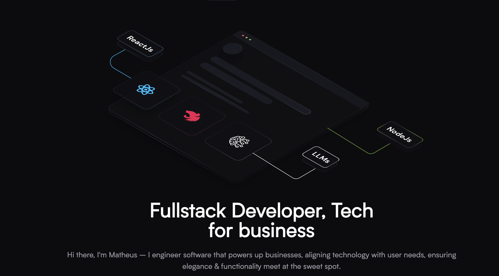

<p align="center">
  
</p>

<h1 align="center">
<a href="https://matheusdeveloper.com" target="_blank">  My Personal Website
</a>
</h1>

<p align="center">
  Welcome to my newly designed personal website! This site is a vibrant showcase of my professional journey, including my recent projects, experiences, and skills. It reflects the diverse aspects of my development career and the milestones that have shaped my path. Dive in and get inspired!
</p>

## ✨ Highlights

- ⚡️ **Next.js** - Powers the front-end for seamless server-side rendering and optimal user experience.
- 🎨 **Tailwind CSS** - Provides styling for a stylish and responsive design.
- 🎭 **Framer Motion** - Adds smooth and engaging animations, enhancing the interactive feel.
- 🚀 **Vercel** - Ensures fast and reliable deployment, giving life to this project on the web.

## Deployed with Vercel

[](https://vercel.com/new/clone?repository-url=https%3A%2F%2Fgithub.com%2Famannn%2Fnext-intl%2Ftree%2Fmain%2Fexamples%2Fexample-app-router)

## Running locally

1. Clone this repo:

```sh
$ git clone https://github.com/silvaMatheus/matheusdeveloper.com.git
```

2. Then go to the project's folder:

```sh
cd matheusdeveloper.com
```

3. Install all dependencies:

```sh
pnpm install
```

4. Run locally:

```sh
pnpm run dev
```
